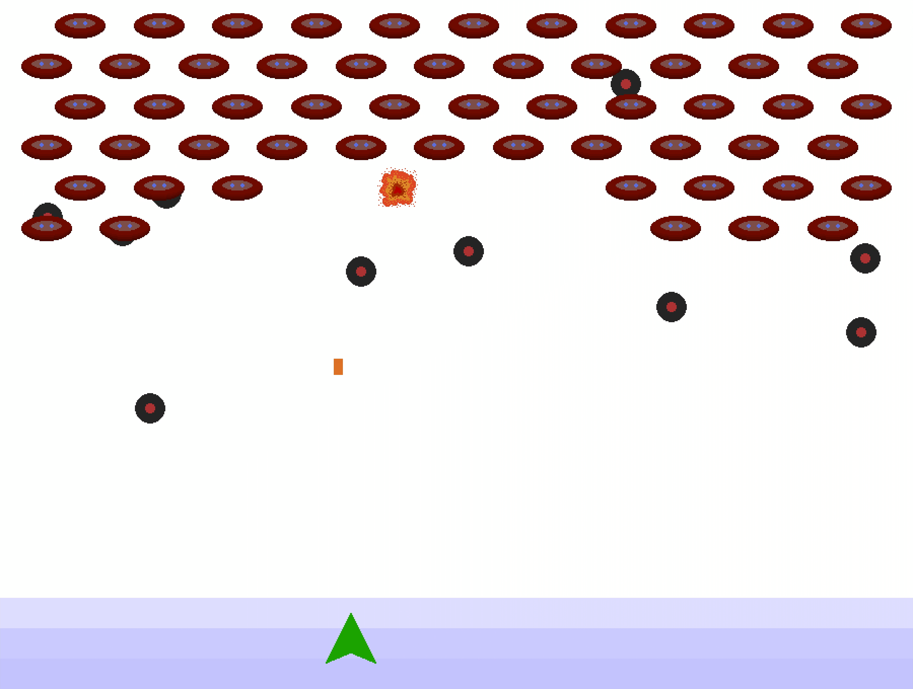

# Fae Invaders

A space invaders inspired demo game built in the [Fae programming language](https://github.com/ForLoveOfCats/fae)

## Building

This game only builds on *Linux* and can build with Fae `0.0.1-1bb34fb-bunded` which is [available here](https://github.com/ForLoveOfCats/fae/releases/tag/2024-November-2).

Assuming an appropriate Fae version and on Linux:
- Run `./meta/fetch_raylib.py`
- Run `fae run` or `fae build`
